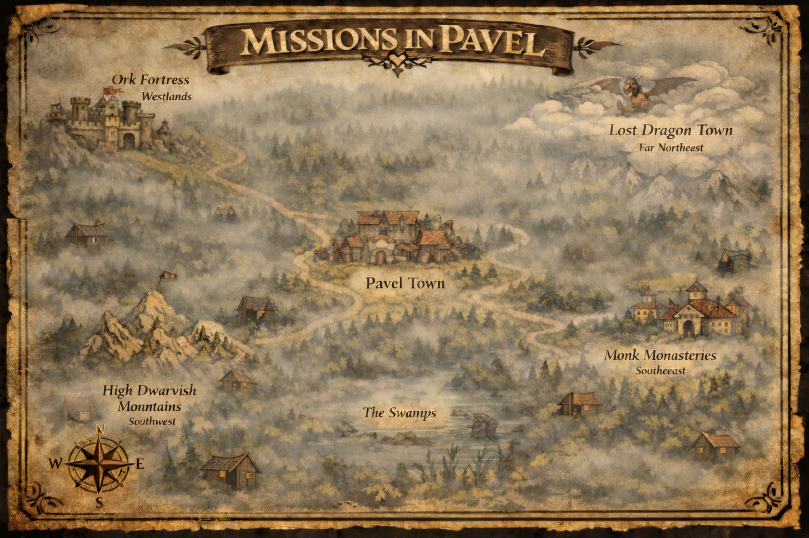

<div align="center">
  
</div>
# Missions of Pavel

**A medieval tavern card game where heroes compete for glory through strategic resource management, unique passive abilities, and tactical decisions. Visit at: https://chamitro.github.io/PAVEL_MISSIONS/**


> 🎮 **Pass-and-Play Local Multiplayer** - Gather your friends, share one device, and take turns competing for glory!

---

## 📖 Overview

**Missions of Pavel** is a **local multiplayer** challenge game designed for 2-10 players sharing the same device. Set in the whimsical village of Pavel, where King Antony's greatest concern is keeping the ale flowing and the peace intact, players take turns selecting from 10 unique heroes—each with their own **special passive ability**—and navigating through a series of trials, managing limited resources to accumulate the most Glory points.

**Perfect for game nights, parties, or gatherings** - just pass the phone, tablet, or laptop around!

### Key Features

- 🎭 **10 Unique Heroes** - Each with distinct abilities, stat distributions, and **unique passive powers**
- ⚡ **Hero Passives** - Special abilities that create unique playstyles and strategic depth
- 📱 **Pass-and-Play Multiplayer** - Everyone shares the same device, taking turns
- 🗺️ **Rich World Lore** - Explore Pavel and its surrounding lands through interactive scrolls
- ⚔️ **Strategic Gameplay** - Manage 5 attributes (POW, SPD, BRN, CHA, WIL) across multiple challenges
- 🤝 **Friend Challenges** - Competitive dual-challenge system for tactical gameplay
- 🎲 **Animated Dice Rolls** - Watch the dice roll with realistic animations
- 🎨 **Medieval Aesthetic** - Immersive parchment design with animated elements and scroll motifs
- 📱 **Fully Responsive** - Play on desktop, tablet, or mobile - works on any screen size

---

## 🎮 How to Play

### Game Setup

**Important:** This is a **local multiplayer game** - all players share the same device and take turns!

1. **Gather Your Group** - Get 2-10 friends together around one device
2. **Explore the Scrolls** - Read about the world, heroes, and rules through interactive parchment scrolls
3. **Choose Party Size** - Select how many players are joining
4. **Register Players** - Each player enters their name and receives a unique hero (no duplicates!)
5. **Set Quest Length** - Decide on 5-70 challenges
6. **Pass the Device** - Players take turns as indicated by the game

### Core Mechanics

**Turn Structure:**
- The game indicates whose turn it is
- **Player to your left** draws a challenge card and chooses difficulty: Minor (1 Glory) or Deadly (2 Glory)
- **Active player** receives the device and decides their approach to the challenge
- After completing your turn, **pass the device** to the next player

**Resource Management:**
- 5 Attributes: POW (Power), SPD (Speed), BRN (Brain), CHA (Charisma), WIL (Willpower)
- Spend attribute points to meet challenge requirements
- **Spent points are consumed** and don't regenerate automatically

**Soul-Type Advantage:**
- If your hero's Soul-Type matches the challenge affinity, receive +3 automatic bonus
- 10 Different affinities: Dark, Tech, Stone, Crowd, Magic, Shadow, Sky, Pub, Silent, Undead

**Decision Options Each Turn:**

1. **Do the Challenge** - Spend attribute points to overcome and gain Glory
2. **Pass (Meditation)** - Skip the challenge (limited to 3 per game)
3. **Challenge a Friend** - Engage another player in competitive dual challenge
   - Both succeed → Both gain Glory
   - One succeeds → Solo winner gets bonus Glory
   - Both fail → No Glory earned

**Drink & Gamble:**
- If you fail a challenge, sacrifice a drink to roll the dice (1-6) for bonus points
- Watch the dice roll with animated 3D dice visualization!

**Recovery System:**
- Every 3 challenges, visit the Alchemist to restore 5 total points across your attributes
- Plan your resource usage carefully!

**Victory Condition:**
- Player with the highest Glory score when all challenges are complete wins

---

## 🦸 The Heroes & Their Passives

Each hero has a **unique passive ability** that creates distinct playstyles!

### Dark Stalker
*Soul: Dark • Affinity: Shadows*  
**Stats:** POW 3 | SPD 5 | BRN 5 | CHA 5 | WIL 4  
**⚡ Passive: Hunt from the Shadows**  
Your stat spending is hidden from opponents until results are revealed.  
*A mysterious observer who knows everyone's secrets.*

### Friendly AI
*Soul: Tech • Affinity: Machinery*  
**Stats:** POW 6 | SPD 4 | BRN 6 | CHA 1 | WIL 5  
**⚡ Passive: System Override**  
Once per game, you can attempt a challenge using a different attribute than required.  
*Magical construct created by wise mages 100 years ago.*

### Thug Dwarf
*Soul: Stone • Affinity: Mountains*  
**Stats:** POW 7 | SPD 2 | BRN 3 | CHA 5 | WIL 6  
**⚡ Passive: Stone Skin**  
When you fail a challenge (including gambles), keep 1 stat point you spent.  
*Stout mountain warrior with incredible strength and endurance.*

### Babbler Rogue
*Soul: Crowd • Affinity: Social*  
**Stats:** POW 2 | SPD 3 | BRN 4 | CHA 8 | WIL 6  
**⚡ Passive: Crowd Favorite**  
Gain +1 Glory for every 3 challenges you complete.  
*Silver-tongued charmer who befriends everyone.*

### Neighbor Mage
*Soul: Magic • Affinity: Mystical*  
**Stats:** POW 2 | SPD 2 | BRN 8 | CHA 3 | WIL 7  
**⚡ Passive: Ritual Circle**  
Can spend BRN instead of the required stat once per game.  
*Retired mage seeking peace and quiet.*

### Shadow Ninja
*Soul: Shadow • Affinity: Stealth*  
**Stats:** POW 4 | SPD 7 | BRN 5 | CHA 2 | WIL 6  
**⚡ Passive: Double Strike**  
Spend SPD twice as effectively (every 1 SPD counts as 2).  
*Swift mercenary paid to complete missions.*

### Lost Dragon
*Soul: Sky • Affinity: Flight*  
**Stats:** POW 8 | SPD 5 | BRN 5 | CHA 3 | WIL 2  
**⚡ Passive: Dragon Rage**  
When spending 5+ on any stat, gain +3 bonus.  
*Ancient dragon searching for the way home.*

### Drunken Paladin
*Soul: Pub • Affinity: Taverns*  
**Stats:** POW 3 | SPD 2 | BRN 3 | CHA 8 | WIL 7  
**⚡ Passive: Liquid Courage**  
At the beginning of each challenge, roll a dice. If 5 or 6, automatically win!  
*War-weary veteran who drinks to forget - and sometimes wins by sheer luck.*

### Mute Monk
*Soul: Silent • Affinity: Meditation*  
**Stats:** POW 3 | SPD 4 | BRN 9 | CHA 2 | WIL 7  
**⚡ Passive: Inner Peace**  
Meditating restores +2 to one attribute of your choice (instead of no benefit).  
*Silent monk with profound wisdom.*

### Lover Zombie
*Soul: Undead • Affinity: Darkness*  
**Stats:** POW 9 | SPD 2 | BRN 4 | CHA 3 | WIL 8  
**⚡ Passive: Undead Hunger**  
Gain +1 to POW every time you complete a challenge.  
*Undead wanderer eternally searching for true love, growing stronger with each trial.*

---

## 🌍 The World of Pavel

**Pavel Town** is a humble village of 5,000 souls united by their love of ale and fellowship. King Antony rules with a simple philosophy: friendship and beer make a stronger kingdom than conquest and coin.

### Notable Locations

- **Lost Dragon Town** (Northeast) - Mystical floating city in the clouds
- **Ork Fortress** (West) - Imposing stronghold where war cries become drinking songs
- **Monk Monasteries** (Southeast) - Peaceful sanctuaries of meditation
- **High Dwarvish Mountains** (Southwest) - Misty peaks home to master craftsmen
- **The Swamps** - Treacherous marshes where trolls lurk

### Key Characters

- **King Antony** - The jovial monarch who prefers taverns to thrones
- **Old Nick the Geezer** - Ancient storyteller and keeper of Pavel's history
- **Panchonco & Yuumi** - The eternal patron and his cat, always at the bar

---

## 🛠️ Technical Details

### Technologies Used

- **Pure HTML5/CSS3/JavaScript** - No frameworks required
- **Local Multiplayer** - Pass-and-play on a single shared device
- **Google Fonts** - Cinzel Decorative, MedievalSharp, Almendra
- **CSS Animations** - Smooth transitions, dice rolling, and subtle effects
- **Responsive Design** - Works perfectly on phones, tablets, and desktops

### Multiplayer Design

This game is specifically designed for **local pass-and-play multiplayer**:
- ✅ One device shared among all players
- ✅ Players take turns as indicated by the game
- ✅ Perfect for parties, game nights, and social gatherings
- ✅ No internet connection required
- ❌ Not an online multiplayer game (no networking features)

### File Structure

```
missions-of-pavel/
├── index.html        # Main game file (self-contained)
├── images/           # Game assets
│   ├── map.png      # World map image
│   ├── dark.png
│   ├── ai.png
│   ├── swag.png
│   ├── rogue.png
│   ├── magic.png
│   ├── ninja.png
│   ├── dragon.png
│   ├── paladin.png
│   ├── monk.png
│   └── zombie.png
└── README.md         # This file
```

### Browser Compatibility

- ✅ Chrome 90+
- ✅ Firefox 88+
- ✅ Safari 14+
- ✅ Edge 90+

---

## 🚀 Getting Started

### Installation

1. Clone the repository:
```bash
git clone https://github.com/yourusername/missions-of-pavel.git
```

2. Navigate to the directory:
```bash
cd missions-of-pavel
```

3. Open `index.html` in your browser:
```bash
# On macOS
open index.html

# On Linux
xdg-open index.html

# On Windows
start index.html
```

**That's it!** No build process, no dependencies, no server required.

### Hosting

Deploy to any static hosting service:

- **GitHub Pages**: Push to `gh-pages` branch
- **Netlify**: Drag and drop the folder
- **Vercel**: Import the repository
- **Any web server**: Upload the files

---

## 🎯 Game Strategy Tips

### General Strategy

1. **Master Your Passive** - Each hero's passive ability can turn the tide; learn to leverage it effectively
2. **Resource Conservation** - Remember, you only get 5 points back every 3 turns
3. **Use Meditations Wisely** - You only have 3 for the entire game
4. **Friend Challenges** - Great for difficult challenges when resources are low
5. **Soul-Type Matching** - The +3 bonus can make impossible challenges achievable
6. **Plan Ahead** - Think about the Alchemist visits when managing resources

### Hero-Specific Tips

- **Dark Stalker**: Use hidden spending to bluff opponents in friend challenges
- **Friendly AI**: Save System Override for impossible challenges
- **Thug Dwarf**: Take risks knowing you'll recover 1 point even on failures
- **Babbler Rogue**: Complete as many challenges as possible for bonus Glory
- **Neighbor Mage**: Save Ritual Circle for when BRN is high but required stat is low
- **Shadow Ninja**: Dominate SPD challenges with double effectiveness
- **Lost Dragon**: Go all-in with 5+ points for massive bonuses
- **Drunken Paladin**: Rely on luck - you have a 33% chance to auto-win each challenge!
- **Mute Monk**: Use all 4 meditations strategically to restore key stats
- **Lover Zombie**: Complete challenges early and often to snowball POW

---

## 🎨 Design Philosophy

**Missions of Pavel** embraces a medieval tavern aesthetic with:

- **Parchment textures** for an authentic feel
- **Ancient scrolls** instead of books for that extra medieval touch
- **Ornate borders and decorations** inspired by illuminated manuscripts  
- **Animated 3D dice** for gambling mechanics
- **Subtle animations** that enhance without overwhelming
- **Warm color palette** of golds, browns, deep reds, and yellows
- **Medieval typography** for immersion
- **Wood-carved title styling** reminiscent of tavern signs

The game balances **tactical depth** with **accessibility**, making it easy to learn but rewarding to master. Each hero's passive ability adds a layer of strategic variety that keeps every playthrough fresh.

---

## 🎲 New Features

### Version 2.0 Updates

- ⚡ **10 Unique Hero Passives** - Each hero now has a special ability that creates distinct playstyles
- 🎲 **Animated Dice Rolls** - 3D dice with rolling animation for Paladin passive and Drink & Gamble
- 📜 **Scroll Interface** - Changed from books to ancient scrolls for enhanced medieval theme
- 🎨 **Refined Color Palette** - Dark red accents and bright gold highlights for better readability
- 🎭 **Hidden Stats (Dark Stalker)** - Stats are concealed from other players except on your turn
- 🔄 **Dynamic Gameplay** - Passives trigger automatically based on game state

---

## 🔮 Future Expansions

Potential additions being considered:

- **Ork Fortress Campaign** - New challenges and heroes from the western fortress
- **Dragon Town Missions** - Sky-based challenges in the floating city
- **Monk Monastery Trials** - Wisdom and meditation-focused gameplay
- **More Passive Abilities** - Additional heroes with unique mechanics
- **Achievement System** - Track player accomplishments across games
- **Online Multiplayer** - Network play to connect with friends remotely (currently local-only)
- **Custom Hero Creator** - Design your own heroes with custom passives
- **Campaign Mode** - Story-driven single-player experience
- **AI Opponents** - Play solo against computer-controlled heroes

---

## 🤝 Contributing

Contributions are welcome! Whether it's:

- 🐛 Bug reports
- 💡 Feature suggestions
- 🎨 Art contributions
- 📝 Documentation improvements
- 🌍 Translations
- ⚡ New passive ability ideas

Please open an issue or submit a pull request.

### Development Guidelines

- Keep the game self-contained (single HTML file preferred)
- Maintain the medieval aesthetic
- Test across multiple browsers and devices
- Follow existing code style
- Add comments for complex logic
- Ensure new passives are balanced and fun

---

## 📜 License

This project is licensed under the MIT License - see the [LICENSE](LICENSE) file for details.

---

## 🙏 Acknowledgments

- Inspired by classic tabletop games and medieval tavern culture
- Font families from Google Fonts
- Texture patterns from transparenttextures.com
- Special thanks to the open-source community
- Dice rolling mechanics inspired by classic board games

---

## 📧 Contact

**Project Link:** [https://github.com/yourusername/missions-of-pavel](https://github.com/yourusername/missions-of-pavel)

---

<div align="center">

**⭐ Star this repository if you enjoyed the game! ⭐**

Made with 🍺 and ❤️

[Play Now](https://chamitro.github.io/PAVEL_MISSIONS/) | [Report Bug](https://github.com/yourusername/missions-of-pavel/issues) | [Request Feature](https://github.com/yourusername/missions-of-pavel/issues)

</div>
