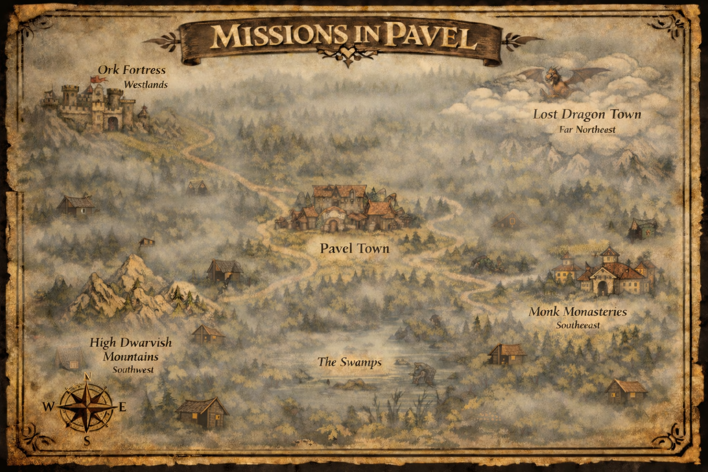

<div align="center">

# Missions in Pavel



**A medieval tavern card game where 20 heroes compete for glory through strategic resource management, unique passive abilities, tactical mind games, and cooperative group missions.**

**Play Online:** [https://chamitro.github.io/PAVEL_MISSIONS/](https://chamitro.github.io/PAVEL_MISSIONS/)


</div>

---

## What Is This?

**Missions in Pavel** can be played in two ways:

1. **Digital (App)** — Open `index.html` in any browser. Pass the device around. The app handles everything: cards, dice, stats, abilities.
2. **Physical (Print & Play)** — Print the card PNGs, grab colored poker chips for stats, a dice, and play at the table like a real board game.

Both modes use the same rules. The digital version automates the math; the physical version gives you the tabletop experience.

---

## How to Play (Digital / App)

### Setup

1. Open [the game](https://chamitro.github.io/PAVEL_MISSIONS/) or `index.html` locally
2. Read the World Lore and Game Rules scrolls (optional but fun)
3. Choose number of players (2-10)
4. Each player enters their name and receives a random hero
5. Set Quest Length (number of rounds)
6. Pass the device — the game tells you whose turn it is

### Turn Flow

Each round, every player takes a turn as **Reader** (the one who draws the card). On someone else's Reader turn, you are a **Challenger**.

**The Reader:**
- Draws a mission card and reads it aloud
- Rolls the Fate Dice to set difficulty (1-3 = Easy, 4-6 = Hard)
- Knows the secret target number (others don't!)
- Does NOT participate in the challenge

**Each Challenger (clockwise from the Reader) chooses one of three options:**

**1. Attempt the Challenge**
- Spend stat points (POW/SPD/BRN/CHA/WIL as required by the card)
- Your total = Points spent + Soul Affinity bonus (+3 if your soul type matches)
- **WIN** (meet or exceed target): Gain Glory (1 Easy / 2 Hard), get +2 points back. Stage ends.
- **FAIL** (below target): Lose all spent points. But you can roll a **Salvation Dice** (+1 to +6) as a last chance! If you still fail, the challenge passes to the next player.

**2. Meditate (Pass)**
- Skip without spending points
- You have exactly **3 Meditations** for the entire game (they don't regenerate, except +1 at the Alchemist Shop)
- If ALL players meditate or fail, the mission is discarded

**3. Challenge a Friend**
- Challenge another player (not the Reader) to a duel
- The Initiator gets **+3 Courage Bonus** automatically
- Both secretly invest points, then reveal simultaneously
- Both WIN: both gain Glory. One wins: winner gets +1 bonus Glory. Both fail: no Glory.
- After the duel, a new card is drawn and the two duelists sit out

### Group Missions

Special missions (marked with a handshake icon) require teamwork:

- The Reader draws the card and rolls difficulty (does not contribute)
- Each non-Reader votes **YES** (participate) or **NO** (sit out)
- YES voters contribute points; all contributions are combined
- **SUCCESS:** All YES voters gain Glory (+2 Easy / +4 Hard)
- **FAILURE:** You can Gamble (dice adds +1 to +6 to total) for a last chance! If that fails too, all YES voters lose **-3 to ALL five stats**
- NO voters: no reward, no penalty
- Group missions require 3+ players

### The Alchemist Shop

Periodically, the Alchemist appears:
- Each player receives **10 Soul Points** to distribute across stats (max +5 per stat)
- You also regain **+1 Meditation**
- Some hero abilities recharge at the shop
- Timing: 1st shop at Round P+3, then every P+4, P+5... (P = number of players)

### Winning

The game ends when all rounds are complete. **Highest Glory wins.** Tiebreaker: most remaining total stat points, then most remaining Meditations.

---

## How to Play (Physical / Print & Play)

Want to play at the table with real cards? Here's everything you need:

### What You Need

| Item | Details |
|------|---------|
| **Mission Cards** | 100 regular + 50 group mission cards (print from `all_cards/missions/` and `all_cards/group_missions/`) |
| **Hero Cards** | 20 hero cards (print from `all_cards/heroes/`) |
| **Stat Reference Cards** | 5 cards explaining each stat (print from `all_cards/stats/`) |
| **Colored Chips/Tokens** | 5 colors, like poker chips — at least 10 per color per player |
| **One 6-sided Dice** | For Fate Dice, abilities, and gambling |
| **Glory Tracker** | Paper, tokens, or a separate counter per player |
| **Meditation Tokens** | 3 per player (coins, stones, anything small) |
| **Rules Book** | Print from `all_cards/rules_book/` (7 pages) |
| **World Book** (optional) | Print from `all_cards/world_book/` (6 pages) |

### Stat Chips (Color System)

Use **5 colors of poker chips** to track each player's stats physically:

| Color | Stat | Abbreviation |
|-------|------|-------------|
| Red | Power | POW |
| Blue | Speed | SPD |
| Purple | Brain | BRN |
| Yellow | Charisma | CHA |
| Green | Willpower | WIL |

At game start, each player takes chips matching their hero's starting stats (e.g., Dark Stalker starts with 5 of each color = 25 chips).

**Spending stats** = return chips to the bank. **Gaining stats** = take chips from the bank.

### Printing the Cards

**English cards:**
```
all_cards/
  missions/         — 100 mission card PNGs
  group_missions/   — 50 group mission card PNGs
  heroes/           — 20 hero card PNGs
  stats/            — 5 stat reference card PNGs
  rules_book/       — 7 rules book page PNGs
  world_book/       — 6 world book page PNGs
```

**Greek cards:**
```
all_cards_gr/       — Same structure, fully translated to Greek
```

**To print:**
1. Open the card images from the folders above
2. Print at actual size or fit to page — cards are high-resolution (3x DPI)
3. For best results, print on cardstock and cut to size
4. Alternatively, open `card_generator.html` (English) or `card_generator_gr.html` (Greek) in your browser and use the built-in **Print / Save PDF** button to export all cards at once

**Tip:** Sleeve your cards in standard card sleeves for durability.

### Physical Game Setup

1. Shuffle mission cards into one deck (keep group missions separate or mixed in — your choice)
2. Deal each player a random hero card
3. Give each player stat chips matching their hero's starting stats
4. Give each player 3 Meditation tokens
5. Decide on number of rounds
6. The youngest player (or random choice) is the first Reader

### Physical Play Differences

The rules are identical to the digital version, with these notes:

- **The Reader** draws from the mission deck, rolls the dice for difficulty, and checks the card for the target number. They announce "Easy" or "Hard" but keep the exact number secret.
- **Challengers** place chips face-down to commit, then reveal.
- **Soul Affinity** is secret — don't show your hero card's soul type to others! Add your +3 bonus yourself.
- **Track Glory** on paper or with a separate set of tokens.
- **The Alchemist Shop** happens at the scheduled rounds — distribute 10 chips (any color, max 5 per stat) to each player and return 1 Meditation token.

### Re-generating Cards

If you want to regenerate the PNG cards (e.g., after modifications):

```bash
# Install dependencies (first time only)
npm install puppeteer

# Export English cards
node export_cards.js

# Export Greek cards
node export_cards_gr.js
```

This requires Google Chrome installed and produces 188 PNGs per language in `all_cards/` and `all_cards_gr/`.

---

## The 20 Heroes

Every hero has unique stats, a Soul Affinity (for +3 bonus on matching missions), and a powerful passive ability.

| Hero | Soul | POW | SPD | BRN | CHA | WIL | Passive |
|------|------|-----|-----|-----|-----|-----|---------|
| Dark Stalker | Dark | 5 | 5 | 5 | 5 | 5 | **Shadow Control** — Force a player to use a Meditation |
| Friendly AI | Tech | 6 | 5 | 6 | 2 | 6 | **System Override** — Once per game: reset all stats to initial values |
| Thug Dwarf | Stone | 7 | 2 | 2 | 5 | 6 | **Brute Force** — +3 POW permanently on every win |
| Babbler Rogue | Crowd | 2 | 4 | 5 | 8 | 6 | **Crowd Favorite** — +1 bonus Glory every 3 challenges completed |
| Neighbor Witch | Magic | 2 | 3 | 8 | 4 | 7 | **Arcane Alliance** — Guess how many points to steal; fail = spell fails |
| Fancy Ninja | Shadow | 4 | 7 | 5 | 3 | 5 | **Assassination Contract** — Bet on another player failing |
| Lost Dragon | Sky | 8 | 5 | 4 | 3 | 3 | **Dragon Rage** — Spend 4+ on any stat = +3 bonus |
| Drunken Paladin | Pub | 3 | 2 | 3 | 8 | 7 | **Liquid Courage** — Roll dice each stage; 5-6 = instant win |
| Mute Monk | Silent | 3 | 3 | 9 | 6 | 7 | **Inner Peace** — Meditation restores +4 to any stat |
| Lover Zombie | Undead | 9 | 2 | 4 | 3 | 8 | **Cursed Embrace** — On win: all others lose -2 from a stat; you gain +1 |
| Devil Boy | Dark | 4 | 4 | 7 | 6 | 4 | **Soul Contract** — Swap a stat value with another player permanently |
| Quick Thief | Shadow | 3 | 8 | 5 | 5 | 3 | **Lucky Fingers** — Roll 5-6 each challenge: steal 1 Glory |
| Sad Troll | Silent | 7 | 2 | 3 | 3 | 9 | **Rising Spirit** — Every 3 consecutive wins: +5 to any stat |
| Forest Spirit | Dark | 3 | 3 | 4 | 5 | 5 | **Nature's Gamble** — On win, roll dice. 4-6: steal from all tied for most Glory. 1-3: lose to all tied for least Glory |
| Ancient Tree Elder | Magic | 7 | 2 | 8 | 3 | 7 | **Ancient Roots** — Force another hero to join group missions |
| Granny the Priest | Silent | 2 | 1 | 8 | 8 | 7 | **Divine Mercy** — If ALL fail a regular mission, gain +1 Glory |
| Warrior Girl | Stone | 8 | 5 | 6 | 3 | 6 | **Battle Born** — Always +3 bonus in group missions |
| Monkey Boy | Shadow | 4 | 8 | 4 | 4 | 4 | **Chaos Reroll** — Force reroll on ANY dice roll (3 uses, recharges at shop) |
| Wizard of Orks | Magic | 3 | 3 | 5 | 5 | 4 | **Ork Brotherhood** — With an ork ally: immune to all abilities. Without: choose Lucky Fingers or Battle Born |
| Another Drunk Guy | Pub | 6 | 2 | 4 | 4 | 4 | **Drunken Fate** — Every dice roll of 6: +1 ALL stats. With Drunken Paladin: others lose -2 ALL at start |

### 10 Soul Types

| Soul | Heroes |
|------|--------|
| Dark | Dark Stalker, Devil Boy, Forest Spirit |
| Tech | Friendly AI |
| Stone | Thug Dwarf, Warrior Girl |
| Crowd | Babbler Rogue |
| Magic | Neighbor Witch, Ancient Tree Elder, Wizard of Orks |
| Shadow | Fancy Ninja, Quick Thief, Monkey Boy |
| Sky | Lost Dragon |
| Pub | Drunken Paladin, Another Drunk Guy |
| Silent | Mute Monk, Sad Troll, Granny the Priest |
| Undead | Lover Zombie |

---

## The World of Pavel

Pavel Town sits at the heart of a vast realm. A humble village of 5,000 souls united by one truth: there is no problem that cannot be solved with good company and a cold mug of ale.

**Notable Locations:**
- **Lost Dragon Town** (Northeast) — Floating citadel where the last sky-born dragons dwell
- **The Ork Fortress** (West) — Stone and iron stronghold; war cries now replaced with drinking songs
- **Monk Monasteries** (Southeast) — Serene hilltop sanctuaries where enlightenment tastes like honey mead
- **Dwarvish Mountains** (Southwest) — Master craftsmen forging legendary weapons and brewing legendary ales
- **The Swamps** — Treacherous marshes where trolls lurk and few return

**Notable Citizens:**
- **King Antony** — The peaceful king who'd rather buy you a drink than wage a war
- **Old Nick** — Keeper of tales; no one has ever escaped his stories
- **Panchonco & Yuumi** — The eternal patron and his cat, fixtures of the tavern

---

## Project Structure

```
PAVEL_MISSIONS/
├── index.html                          # Main game (self-contained HTML5)
├── images/                             # Hero portraits and world art
├── latest_cards/cards_v3/
│   ├── card_generator.html             # English card renderer (open in browser)
│   └── card_generator_gr.html          # Greek card renderer (open in browser)
├── all_cards/                          # Exported English card PNGs (188 files)
│   ├── missions/                       #   100 mission cards
│   ├── group_missions/                 #   50 group mission cards
│   ├── heroes/                         #   20 hero cards
│   ├── stats/                          #   5 stat reference cards
│   ├── world_book/                     #   6 world book pages
│   └── rules_book/                     #   7 rules book pages
├── all_cards_gr/                       # Exported Greek card PNGs (188 files)
├── export_cards.js                     # Puppeteer export script (English)
├── export_cards_gr.js                  # Puppeteer export script (Greek)
├── Pavel_Missions_Rulebook_GR.html     # Printable Greek rulebook (single page)
└── README.md                           # This file
```

### Tech Stack

- **Pure HTML5/CSS3/JavaScript** — No frameworks, no build step, single file
- **Puppeteer** — For exporting card PNGs at 3x resolution
- **Google Fonts** — Cinzel Decorative, MedievalSharp, Almendra
- **LocalStorage** — Persistent Hall of Victors leaderboard

### Browser Support

Works on Chrome 90+, Firefox 88+, Safari 14+, Edge 90+, and all mobile browsers.

---

## Quick Start

```bash
# Clone
git clone https://github.com/chamitro/PAVEL_MISSIONS.git
cd PAVEL_MISSIONS

# Play (no build needed)
open index.html

# Or visit the live version
# https://chamitro.github.io/PAVEL_MISSIONS/
```

---

## Languages

| Language | Digital Game | Card Generator | Exported Cards | Rulebook |
|----------|-------------|----------------|----------------|----------|
| English | `index.html` | `card_generator.html` | `all_cards/` | In-game scrolls |
| Greek | `index.html` (English only) | `card_generator_gr.html` | `all_cards_gr/` | `Pavel_Missions_Rulebook_GR.html` |

---

## License

MIT License — free to use, modify, and distribute with attribution.

---

<div align="center">

**150 missions. 20 heroes. 10 soul types. 1 tavern.**

[Play Now](https://chamitro.github.io/PAVEL_MISSIONS/) | [Report Bug](https://github.com/chamitro/PAVEL_MISSIONS/issues)

*"Every hero has a story. Every story needs a tavern. Welcome to Pavel."*
— King Antony

</div>
